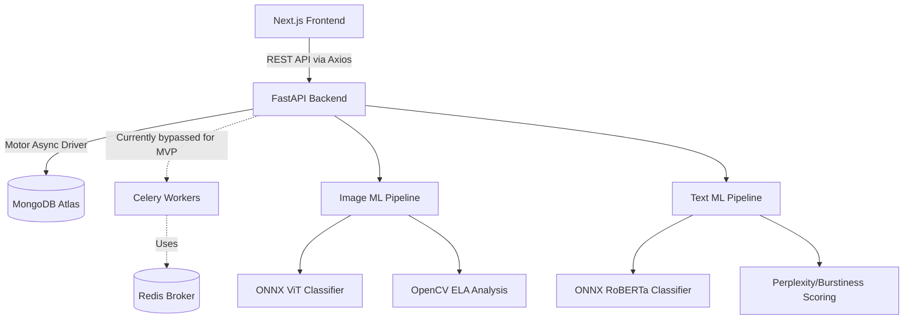
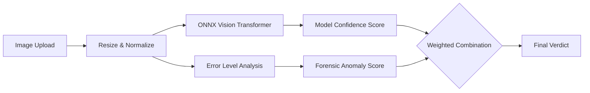
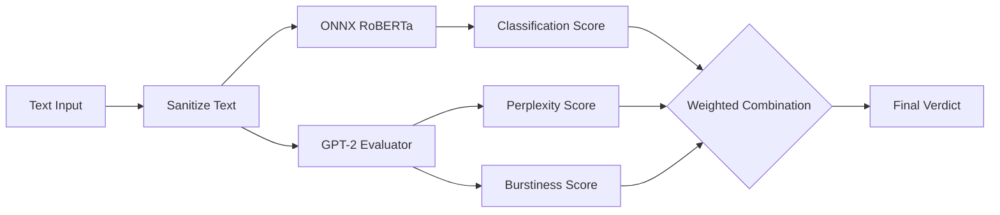
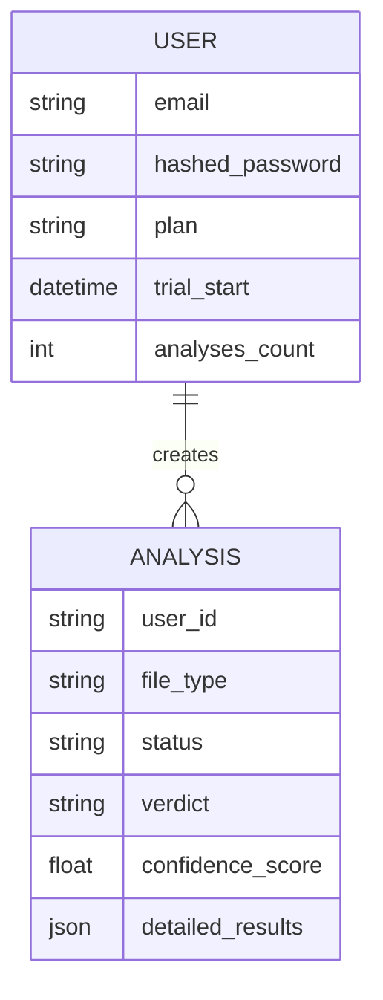

# Dictator Architecture

This document outlines the architecture for the **Dictator — AI Content Authenticity Detector**.

## High-Level Architecture

The platform uses a decoupled architecture with a Next.js frontend, a FastAPI backend, and an asynchronous ML inference layer.

## Machine Learning Pipeline

The ML pipeline is optimized for CPU inference using ONNX Runtime.

### Image Detection

### Text Detection

## Data Models

The database relies on MongoDB. We use `Beanie` as an asynchronous ODM (Object Document Mapper).

