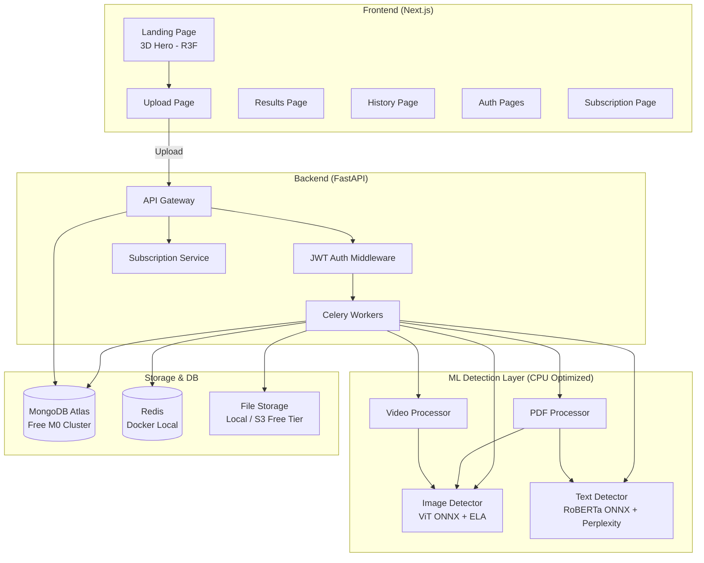

# Dictator — AI Content Authenticity Detector — Implementation Plan (v2)

> A full-stack web platform that analyzes uploaded content (images, text, PDFs, video) and returns a probabilistic verdict on whether it is AI-generated or human-made.

> [!IMPORTANT]
> **Cost constraint**: Everything runs on **free tiers only**. No paid services. MongoDB Atlas M0, AWS Free Tier, CPU-only inference.

## Architecture Overview



---

## Changes from v1

| Item | v1 (Old) | v2 (Updated) |
|---|---|---|
| Database | PostgreSQL + SQLAlchemy | **MongoDB Atlas (free M0)** + Motor/Beanie |
| ML inference | PyTorch (GPU preferred) | **ONNX Runtime** (CPU-optimized, ~2-4s on i5 12th gen) |
| Cost | Unspecified | **All free tiers** — zero cost |
| Payments | None | **Razorpay** (₹100/month VIP after 1-month free trial) |
| Test data | Unspecified | **Public dataset download scripts** (CIFAKE, etc.) |
| Docker services | PostgreSQL + Redis | **Redis only** (MongoDB on Atlas cloud free tier) |

---

## Open Questions (Resolved)

| Question | Answer |
|---|---|
| Database hosting | ✅ MongoDB Atlas free M0 cluster (cloud) + Docker for Redis |
| GPU required? | ✅ **No GPU needed**. ONNX Runtime on your i5 12th gen will give ~2-4s per image, ~1-2s per text. Totally fine for a demo. |
| AWS GPU costs? | ✅ **No GPU on AWS either**. We'll use Lambda (free tier: 1M requests/month) for inference. SageMaker free tier only includes 250hrs/month of `ml.t2.medium` (CPU) — we'll use that or skip SageMaker entirely and run inference in Lambda/ECS. |
| Demo dataset | ✅ Scripts to download CIFAKE (real vs AI images) + HC3 (human vs ChatGPT text) |
| Auth complexity | ✅ Simple JWT with bcrypt (no Cognito needed) |
| Subscription | ✅ Added as **last feature** after core works. Free trial (1 month, 50 analyses) → VIP ₹100/month (unlimited) |

---

## Project Structure

```
d:\AI-image-detection\
├── frontend/                    # Next.js app
│   ├── public/
│   ├── src/
│   │   ├── app/                 # App Router pages
│   │   │   ├── page.tsx         # Landing page (3D hero)
│   │   │   ├── login/
│   │   │   ├── signup/
│   │   │   ├── upload/
│   │   │   ├── result/[id]/
│   │   │   ├── history/
│   │   │   ├── pricing/         # Subscription plans page
│   │   │   └── layout.tsx
│   │   ├── components/
│   │   │   ├── three/           # 3D components (R3F)
│   │   │   │   ├── HeroScene.tsx
│   │   │   │   ├── ParticleField.tsx
│   │   │   │   └── LoadingOrb.tsx
│   │   │   ├── ui/              # Reusable UI components
│   │   │   │   ├── FileUploader.tsx
│   │   │   │   ├── ConfidenceGauge.tsx
│   │   │   │   ├── VerdictCard.tsx
│   │   │   │   ├── Navbar.tsx
│   │   │   │   ├── ThemeToggle.tsx
│   │   │   │   └── HistoryTable.tsx
│   │   │   └── charts/
│   │   │       └── ScoreChart.tsx
│   │   ├── lib/
│   │   │   ├── api.ts           # API client
│   │   │   ├── auth.ts          # Auth helpers
│   │   │   └── types.ts         # TypeScript types
│   │   └── styles/
│   │       └── globals.css
│   ├── tailwind.config.ts
│   ├── next.config.js
│   └── package.json
│
├── backend/                     # FastAPI app
│   ├── app/
│   │   ├── main.py              # FastAPI app entry
│   │   ├── config.py            # Settings / env vars
│   │   ├── database.py          # MongoDB connection (Motor)
│   │   ├── models/              # MongoDB document models (Beanie)
│   │   │   ├── user.py
│   │   │   ├── analysis.py
│   │   │   └── subscription.py
│   │   ├── schemas/             # Pydantic request/response schemas
│   │   │   ├── user.py
│   │   │   └── analysis.py
│   │   ├── routers/             # API route handlers
│   │   │   ├── auth.py
│   │   │   ├── analyze.py
│   │   │   ├── results.py
│   │   │   └── subscription.py
│   │   ├── services/            # Business logic
│   │   │   ├── auth_service.py
│   │   │   ├── analysis_service.py
│   │   │   ├── file_service.py
│   │   │   └── subscription_service.py
│   │   ├── tasks/               # Celery tasks
│   │   │   ├── celery_app.py
│   │   │   ├── image_task.py
│   │   │   └── text_task.py
│   │   └── utils/
│   │       ├── jwt.py
│   │       └── security.py
│   ├── requirements.txt
│   ├── Dockerfile
│   └── tests/
│       ├── test_auth.py
│       ├── test_analyze.py
│       └── conftest.py
│
├── ml/                          # ML detection models
│   ├── image_detector/
│   │   ├── model.py             # ONNX image classifier wrapper
│   │   ├── ela.py               # Error Level Analysis
│   │   ├── predict.py           # Inference entry point
│   │   └── export_onnx.py       # Convert HF model → ONNX
│   ├── text_detector/
│   │   ├── model.py             # ONNX text classifier wrapper
│   │   ├── perplexity.py        # Perplexity/burstiness scoring
│   │   └── predict.py           # Inference entry point
│   ├── data/
│   │   └── download_datasets.py # Script to download CIFAKE + HC3
│   ├── utils/
│   │   └── preprocessing.py
│   └── requirements.txt
│
├── docker-compose.yml           # Redis (MongoDB is on Atlas)
├── .env.example
├── README.md
└── docs/
    └── architecture.md
```

---

## Phase 1 — MVP (Primary Focus)

### 1.1 Project Scaffolding & Infrastructure

#### [NEW] [docker-compose.yml](file:///d:/AI-image-detection/docker-compose.yml)
- **Redis 7** container only (port 6379) — for Celery task queue
- MongoDB is hosted on **Atlas free M0** (no Docker needed)
- Volume mount for Redis persistence

#### [NEW] [.env.example](file:///d:/AI-image-detection/.env.example)
```env
# MongoDB Atlas (free M0 cluster)
MONGODB_URI=mongodb+srv://<user>:<pass>@cluster0.xxxxx.mongodb.net/dictator?retryWrites=true&w=majority
MONGODB_DB_NAME=dictator

# Redis (local Docker)
REDIS_URL=redis://localhost:6379/0

# JWT
JWT_SECRET=your-secret-key-change-in-production
JWT_ALGORITHM=HS256
JWT_EXPIRY_HOURS=24

# File uploads
UPLOAD_DIR=./uploads
MAX_FILE_SIZE_MB=10

# ML Models (Hugging Face model IDs)
HF_MODEL_IMAGE=umm-maybe/AI-image-detector
HF_MODEL_TEXT=roberta-base-openai-detector

# Razorpay (add later for subscriptions)
# RAZORPAY_KEY_ID=
# RAZORPAY_KEY_SECRET=
```

#### [NEW] [README.md](file:///d:/AI-image-detection/README.md)
- Project overview, setup instructions (MongoDB Atlas setup guide, Docker for Redis, Python venv, npm install)
- API docs, architecture diagram link

#### [NEW] [ml/data/download_datasets.py](file:///d:/AI-image-detection/ml/data/download_datasets.py)
- Script to download **CIFAKE dataset** (real vs AI-generated images, ~60K images from Kaggle)
- Script to download **HC3 dataset** (Human ChatGPT Comparison Corpus for text)
- Uses `huggingface_hub` or `kagglehub` for downloads
- Organizes into `data/images/real/`, `data/images/ai/`, `data/text/human/`, `data/text/ai/`

---

### 1.2 Backend — FastAPI + MongoDB

#### [NEW] [backend/app/database.py](file:///d:/AI-image-detection/backend/app/database.py)
- **Motor** (async MongoDB driver) connection setup
- **Beanie** ODM (Object Document Mapper) initialization
- `init_db()` function called on FastAPI startup to initialize Beanie with document models
- Connection string from `MONGODB_URI` env var

#### [NEW] [backend/app/models/user.py](file:///d:/AI-image-detection/backend/app/models/user.py)
- Beanie `Document` class:
```python
class User(Document):
    email: str                    # unique index
    hashed_password: str
    plan: str = "free_trial"      # free_trial | vip | expired
    trial_start: datetime
    analyses_count: int = 0       # track usage for free tier limits
    created_at: datetime

    class Settings:
        name = "users"
        indexes = [IndexModel([("email", 1)], unique=True)]
```

#### [NEW] [backend/app/models/analysis.py](file:///d:/AI-image-detection/backend/app/models/analysis.py)
- Beanie `Document` class:
```python
class Analysis(Document):
    user_id: PydanticObjectId     # reference to User
    file_type: str                # image | text | pdf | video
    original_filename: str | None
    file_path: str | None
    input_text: str | None        # for text analysis
    status: str = "pending"       # pending | processing | completed | failed
    verdict: str | None           # ai_generated | human_made | inconclusive
    confidence_score: float | None
    explanation: str | None
    detailed_results: dict | None # raw model outputs, scores breakdown
    created_at: datetime
    completed_at: datetime | None

    class Settings:
        name = "analyses"
        indexes = [IndexModel([("user_id", 1), ("created_at", -1)])]
```

#### [NEW] [backend/app/routers/auth.py](file:///d:/AI-image-detection/backend/app/routers/auth.py)
- `POST /api/auth/signup` — validate email format, check uniqueness, hash password (bcrypt), create User document, set `trial_start = now()`, return JWT
- `POST /api/auth/login` — find user by email, verify password, return JWT
- JWT payload: `{ user_id, email, plan, exp }`

#### [NEW] [backend/app/routers/analyze.py](file:///d:/AI-image-detection/backend/app/routers/analyze.py)
- **Quota check middleware**: Before accepting upload, check if user is within their plan limits:
  - `free_trial`: 50 analyses within 30 days of `trial_start`
  - `vip`: unlimited
  - `expired`: return 403 with "Please upgrade to VIP"
- `POST /api/analyze/image` — accept JPEG/PNG/WebP (max 10MB), save to `UPLOAD_DIR`, create Analysis doc, dispatch Celery task, return `{ analysis_id }`
- `POST /api/analyze/text` — accept JSON `{ text }` (max 10,000 chars), save text in Analysis doc, dispatch Celery task, return `{ analysis_id }`

#### [NEW] [backend/app/routers/results.py](file:///d:/AI-image-detection/backend/app/routers/results.py)
- `GET /api/result/{id}` — return full analysis result (only if user owns it)
- `GET /api/history` — return paginated list of user's analyses, sorted newest first
  - Query params: `page` (default 1), `limit` (default 20)
  - Returns: `{ analyses: [...], total, page, pages }`

#### [NEW] [backend/app/tasks/image_task.py](file:///d:/AI-image-detection/backend/app/tasks/image_task.py)
- `analyze_image_task(analysis_id: str)`:
  1. Update status → "processing"
  2. Load image from disk
  3. Run ONNX image classifier → `(label, confidence)`
  4. Run ELA analysis → `ela_score`
  5. Combine: `final_score = 0.7 * model_confidence + 0.3 * ela_score`
  6. Determine verdict: score > 0.7 → "ai_generated", score < 0.3 → "human_made", else → "inconclusive"
  7. Generate natural-language explanation
  8. Update Analysis doc with results, status → "completed"

#### [NEW] [backend/app/tasks/text_task.py](file:///d:/AI-image-detection/backend/app/tasks/text_task.py)
- `analyze_text_task(analysis_id: str)`:
  1. Update status → "processing"
  2. Load text from Analysis doc
  3. Run ONNX text classifier → `(label, confidence)`
  4. Compute perplexity + burstiness → `(perplexity_score, burstiness_score)`
  5. Combine: `final_score = 0.6 * classifier + 0.25 * perplexity + 0.15 * burstiness`
  6. Determine verdict + generate explanation
  7. Update Analysis doc

---

### 1.3 ML Detection Layer (CPU-Optimized)

> [!TIP]
> **Why ONNX?** ONNX Runtime on CPU is **3-5x faster** than PyTorch on CPU. On your i5 12th gen, expect ~2-4 seconds per image and ~1-2 seconds per text. This is perfectly acceptable for a demo.

#### [NEW] [ml/requirements.txt](file:///d:/AI-image-detection/ml/requirements.txt)
```
onnxruntime>=1.18.0          # CPU inference (NOT onnxruntime-gpu)
transformers>=4.40.0          # Model loading + tokenizers
torch>=2.3.0                  # Needed for model export only
optimum[onnxruntime]>=1.19.0  # HF ONNX export utility
opencv-python-headless>=4.9.0 # ELA + image processing
Pillow>=10.3.0
numpy>=1.26.0
scikit-learn>=1.4.0
```

#### [NEW] [ml/image_detector/model.py](file:///d:/AI-image-detection/ml/image_detector/model.py)
- Uses `optimum.onnxruntime.ORTModelForImageClassification` for ONNX inference
- Default model: `umm-maybe/AI-image-detector` (ViT-base, fine-tuned on real vs AI images)
- Auto-downloads and caches the ONNX version from HuggingFace
- Methods:
  - `load()` — download/cache model + feature extractor
  - `predict(image_path) → { label, confidence, raw_logits }`
- Image preprocessing: resize to 224×224, normalize with ImageNet stats

#### [NEW] [ml/image_detector/ela.py](file:///d:/AI-image-detection/ml/image_detector/ela.py)
- Error Level Analysis:
  1. Load image → re-save as JPEG at quality 95
  2. Compute absolute pixel difference between original and re-saved
  3. Analyze difference stats: `mean_diff`, `std_diff`, `max_diff`
  4. AI-generated images often show uniform error levels (low `std_diff`)
  5. Return `ela_score` (0-1, higher = more likely AI)
- Secondary: DCT frequency analysis — AI images lack high-frequency noise patterns

#### [NEW] [ml/image_detector/predict.py](file:///d:/AI-image-detection/ml/image_detector/predict.py)
- Combines `model.predict()` + `ela.analyze()`
- Weighted combination: `final = 0.7 * model + 0.3 * ela`
- Returns: `{ verdict, confidence, model_score, ela_score, explanation }`

#### [NEW] [ml/text_detector/model.py](file:///d:/AI-image-detection/ml/text_detector/model.py)
- Uses `optimum.onnxruntime.ORTModelForSequenceClassification`
- Default model: `openai-community/roberta-base-openai-detector`
- Tokenization: `RobertaTokenizer`, max 512 tokens with truncation
- Methods: `load()`, `predict(text) → { label, confidence, raw_logits }`

#### [NEW] [ml/text_detector/perplexity.py](file:///d:/AI-image-detection/ml/text_detector/perplexity.py)
- Uses `gpt2` (small, 124M params — runs fine on CPU) to compute perplexity
- Split text into sentences → compute per-sentence perplexity
- **Perplexity score**: AI text has lower perplexity (more "predictable")
- **Burstiness score**: AI text has more uniform sentence-level perplexity (lower variance)
- Both scores normalized to 0-1 range
- Note: This is the heaviest CPU operation (~3-5s for long text). Cache the GPT-2 model in memory.

#### [NEW] [ml/image_detector/export_onnx.py](file:///d:/AI-image-detection/ml/image_detector/export_onnx.py)
- One-time script to export HuggingFace PyTorch models to ONNX format
- Uses `optimum` library for seamless conversion
- Saves optimized ONNX models to `ml/models/` directory

---

### 1.4 Frontend — Next.js + Tailwind CSS

#### [NEW] Frontend project initialization
```bash
cd d:\AI-image-detection\frontend
npx -y create-next-app@latest ./ --typescript --tailwind --eslint --app --src-dir --no-import-alias
```
- Additional dependencies:
```bash
npm install @react-three/fiber @react-three/drei three @types/three
npm install recharts axios react-dropzone lucide-react
npm install @react-three/postprocessing
```

#### [NEW] [frontend/src/styles/globals.css](file:///d:/AI-image-detection/frontend/src/styles/globals.css)
- Design tokens as CSS custom properties:
  - Dark mode (default): `--bg-primary: #0a0a0f`, `--bg-surface: #1a1a2e`, `--accent-real: #00d4ff` (cyan), `--accent-ai: #ff006e` (magenta)
  - Light mode: inverted palette with soft whites and deep accents
- Google Font imports: Inter (body), JetBrains Mono (data/scores)
- Glassmorphism utilities: `.glass { backdrop-filter: blur(12px); background: rgba(255,255,255,0.05); }`
- Micro-animation keyframes: fadeIn, slideUp, pulse, glow

#### [NEW] [frontend/src/app/page.tsx](file:///d:/AI-image-detection/frontend/src/app/page.tsx) — Landing Page
- **3D Hero Section**: Lazy-loaded R3F canvas with particle sphere
- **Feature cards**: Image, Text, PDF (coming soon), Video (coming soon)
- **Stats section**: "Analyzed X files" counter animation
- **CTA**: "Start Free Trial" → `/signup`
- **Pricing preview**: Free Trial vs VIP comparison
- **Disclaimer**: Probabilistic assessment notice
- Smooth scroll-triggered animations

#### [NEW] [frontend/src/components/three/HeroScene.tsx](file:///d:/AI-image-detection/frontend/src/components/three/HeroScene.tsx)
- `<Canvas>` with `<Suspense>` fallback (static gradient)
- `<ParticleField>` component inside
- Bloom post-processing (`@react-three/postprocessing`)
- Camera position: `[0, 0, 5]`, FOV 75
- `dpr={[1, 1.5]}` for performance (cap pixel ratio)

#### [NEW] [frontend/src/components/three/ParticleField.tsx](file:///d:/AI-image-detection/frontend/src/components/three/ParticleField.tsx)
- ~2000 particles on desktop, ~500 on mobile (detect via `window.innerWidth`)
- Particles arranged in a sphere (fibonacci spiral distribution)
- Two color groups: cyan (real) and magenta (AI) — split 50/50
- Animation: slow rotation on Y-axis, particles drift apart over time
- Mouse interaction: `useFrame` + pointer position → subtle parallax shift
- Custom `ShaderMaterial` for size attenuation + alpha fade at edges

#### [NEW] [frontend/src/app/upload/page.tsx](file:///d:/AI-image-detection/frontend/src/app/upload/page.tsx)
- **Auth guard**: Redirect to `/login` if not authenticated
- **Quota display**: "X of 50 free analyses remaining" (for free trial users)
- **File type tabs**: Image | Text (PDF & Video show "Coming Soon" badge)
- **Image tab**: `react-dropzone` with drag-and-drop, file preview, size validation
- **Text tab**: Large textarea with character counter, paste support
- **Upload progress**: Animated progress bar during upload
- **Submit**: POST to API → redirect to `/result/[id]`

#### [NEW] [frontend/src/app/result/[id]/page.tsx](file:///d:/AI-image-detection/frontend/src/app/result/%5Bid%5D/page.tsx)
- **Polling**: While `status === "processing"`, poll `GET /api/result/{id}` every 2 seconds
- **Loading state**: Animated loading orb (optional: R3F 3D orb) + "Analyzing your content..."
- **Result display**:
  - Large verdict badge: 🟢 "Human Made" / 🔴 "AI Generated" / 🟡 "Inconclusive"
  - Animated confidence gauge (donut chart, Recharts)
  - Score breakdown cards: Model score, ELA/Perplexity score, Burstiness
  - Explanation text in a card
  - **Disclaimer banner**: "This system provides a probabilistic assessment..."
- **Actions**: "Analyze Another" button, "View History" link

#### [NEW] Auth pages, History page, Navbar, API client
- Same as v1 plan — see project structure above
- History page includes analysis count + plan status badge

---

### 1.5 Design System

| Element | Specification |
|---|---|
| **Background** | Dark: `#0a0a0f` → `#12121a` gradient. Light: `#f8f9fa` → `#ffffff` |
| **Surfaces** | Dark: `#1a1a2e` with `border: 1px solid rgba(255,255,255,0.08)`. Light: `#ffffff` with subtle shadow |
| **Accent (Real/Safe)** | Cyan `#00d4ff` — used for "Human Made" verdicts |
| **Accent (AI/Flagged)** | Magenta `#ff006e` — used for "AI Generated" verdicts |
| **Accent (Neutral)** | Amber `#ffbe0b` — used for "Inconclusive" |
| **Typography** | Inter 400/500/600/700 for body; JetBrains Mono for scores/data |
| **Cards** | Glassmorphism: `backdrop-filter: blur(12px)`, `bg-white/5` dark, `bg-white/80` light |
| **Buttons** | Gradient fills (cyan→blue for primary), hover: scale(1.02) + glow shadow |
| **Transitions** | All interactive elements: `transition: all 0.2s ease` |
| **Border radius** | Cards: `16px`, Buttons: `12px`, Inputs: `8px` |

---

## Phase 2 — Extensions (After Phase 1 is Stable)

### 2.1 PDF Support
- Same as v1 — `pdfplumber` + `pytesseract` for extraction
- Route through existing text/image detectors
- `POST /api/analyze/pdf` endpoint + Celery task

### 2.2 Video Support
- Same as v1 — OpenCV frame sampling + image detector
- Temporal consistency analysis
- `POST /api/analyze/video` endpoint + Celery task

### 2.3 Downloadable Report
- `reportlab` PDF generation with verdict, scores, explanation, disclaimer
- `GET /api/result/{id}/report` endpoint

### 2.4 Explainability
- Grad-CAM heatmaps for image analysis
- Per-sentence highlighting for text analysis

---

## Phase 3 — Subscription System & Deployment

### 3.1 Subscription System (Build Last)

> [!NOTE]
> This is built **after** all core detection features work. The subscription model is:
> - **Free Trial**: 1 month, 50 analyses max
> - **VIP**: ₹100/month, unlimited analyses
> - Trial auto-expires after 30 days → user sees upgrade prompt

#### [NEW] [backend/app/models/subscription.py](file:///d:/AI-image-detection/backend/app/models/subscription.py)
```python
class Subscription(Document):
    user_id: PydanticObjectId
    plan: str              # "free_trial" | "vip"
    status: str            # "active" | "expired" | "cancelled"
    started_at: datetime
    expires_at: datetime   # trial_start + 30 days for free, renewal date for VIP
    razorpay_subscription_id: str | None
    payment_history: list[dict]  # [{amount, date, razorpay_payment_id}]

    class Settings:
        name = "subscriptions"
```

#### [NEW] [backend/app/routers/subscription.py](file:///d:/AI-image-detection/backend/app/routers/subscription.py)
- `GET /api/subscription/status` — return current plan, remaining analyses, expiry date
- `POST /api/subscription/create-order` — create Razorpay order for ₹100
- `POST /api/subscription/verify-payment` — verify Razorpay payment signature, upgrade user to VIP
- `GET /api/subscription/plans` — return available plans with pricing

#### Payment Integration: **Razorpay**
- Razorpay is the best choice for INR payments (free to set up, 2% transaction fee)
- Frontend: Razorpay Checkout.js (drop-in payment form)
- Flow: User clicks "Upgrade" → frontend creates order via API → Razorpay popup → payment verified on backend → user plan updated in MongoDB

#### [NEW] [frontend/src/app/pricing/page.tsx](file:///d:/AI-image-detection/frontend/src/app/pricing/page.tsx)
- Two-column pricing comparison:
  - **Free Trial**: ✅ 50 analyses, ✅ Image + Text, ✅ 1 month, ❌ PDF/Video, ❌ Reports
  - **VIP (₹100/mo)**: ✅ Unlimited, ✅ All file types, ✅ PDF reports, ✅ Priority processing
- "Upgrade Now" button → Razorpay checkout flow

### 3.2 AWS Deployment (Free Tier Only)

| Purpose | AWS Free Tier Service | Free Tier Limit |
|---|---|---|
| Frontend | **AWS Amplify** | 1000 build minutes/month, 15GB hosting |
| API | **API Gateway** | 1M API calls/month |
| Backend | **AWS Lambda** | 1M requests/month, 400K GB-seconds |
| ML inference | **Lambda** (with ONNX model in layer) or **EC2 t2.micro** | 750 hrs/month (EC2) |
| File storage | **S3** | 5GB storage, 20K GET, 2K PUT |
| Database | **MongoDB Atlas M0** (not AWS) | 512MB free forever |
| Monitoring | **CloudWatch** | 10 custom metrics, 1M API calls |

> [!IMPORTANT]
> SageMaker is expensive even on free tier and overkill for this project. We'll deploy ML models directly inside Lambda functions (pack ONNX model as a Lambda Layer, ~50MB) or on a free-tier EC2 `t2.micro` instance. This keeps costs at **$0**.

### 3.3 Other Stretch Goals
- Batch upload, Public REST API, Admin dashboard — same as v1

---

## Verification Plan

### Automated Tests
```bash
# Backend tests
cd backend && pytest tests/ -v

# ML model smoke tests
cd ml && python -c "from image_detector.predict import predict_image; print(predict_image('test.jpg'))"
cd ml && python -c "from text_detector.predict import predict_text; print(predict_text('Hello world'))"
```

### Manual Verification
1. **Auth flow**: Signup → login → JWT stored → protected routes accessible
2. **Image detection**: Upload CIFAKE AI image → expect "AI Generated" with >70% confidence
3. **Image detection**: Upload real photo → expect "Human Made"
4. **Text detection**: Paste ChatGPT output → expect "AI Generated"
5. **Text detection**: Paste Wikipedia paragraph → expect "Human Made"
6. **History**: Multiple analyses appear in history, sorted by date
7. **Quota**: Free trial user sees remaining count, blocks after 50
8. **3D hero**: Particle animation renders, responds to mouse
9. **Responsive**: Test 375px (mobile) and 1440px (desktop)
10. **Performance**: Image analysis completes in <5s on i5 CPU

### Demo Script for Viva
1. Open landing → 3D hero + feature overview
2. Sign up → redirected to upload page
3. Upload real photo → "Human Made" ~85% confidence
4. Upload DALL-E image → "AI Generated" ~90% confidence
5. Paste human text → "Human Made"
6. Paste ChatGPT response → "AI Generated"
7. View history → all 4 analyses listed
8. Show pricing page → Free Trial vs VIP
9. Explain probabilistic disclaimer
10. Show architecture diagram → explain tech stack
